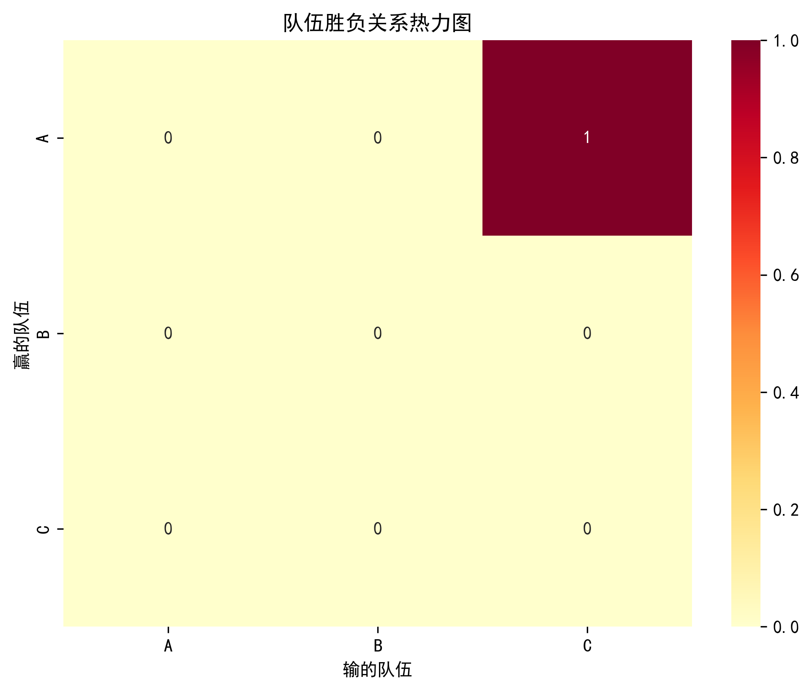

# Badminton-Scoring

本项目旨在为羽毛球队伍建立一个基于 Glicko 评分系统的评价模型，
用于评估每支队伍的水平，并通过可视化展示评分结果。
系统仅依赖比赛的胜负数据，适合没有细化技术指标的场景。

---

## 项目功能

1. **Glicko 评分系统**：
   - 根据比赛结果动态更新队伍的评分和评分偏差（RD）。
   - 支持初始评分、RD 和波动率的自定义设置。

2. **数据可视化**：
   - 生成队伍评分趋势图。
   - 生成队伍评分偏差趋势图。
   - 生成队伍之间的胜负关系热力图。

3. **简单易用**：
   - 提供清晰的 API 接口和pip安装，方便集成到其他项目中。
   - 支持 CSV 数据导入和导出。

---

## 安装与运行

### 依赖安装

确保已安装 Python 3.8+，然后运行以下命令安装依赖：

```bash
pip install -r requirements.txt
```

### 运行示例

1. 将比赛数据保存为 `matches.csv` 文件，格式如下：

| match_id | team_A | team_B | winner |
|----------|--------|--------|--------|
| 1        | A      | B      | A      |
| 2        | B      | C      | B      |
| 3        | C      | A      | C      |

2. 运行主程序：

```bash
python main.py
```

3. 查看生成的评分结果和可视化图表。

---

## 文件结构

```
Badminton-Scoring/
├── data/                    # 数据文件夹
│   └── matches.csv          # 比赛数据
├── src/                     # 源代码文件夹
│   ├── data_preprocessing.py # 数据获取与预处理
│   ├── glicko_model.py      # Glicko 评分系统实现
│   ├── visualizer.py        # 数据可视化工具
│   └── main.py              # 主程序
├── requirements.txt         # 依赖文件
└── README.md                # 项目说明
```

---

## API 参考

### Glicko 评分系统

```python
from src.glicko import GlickoRating

# 初始化队伍评分
team_ratings = {
    "A": GlickoRating(rating=1500, rd=350),
    "B": GlickoRating(rating=1500, rd=350),
    "C": GlickoRating(rating=1500, rd=350),
}

# 更新评分
team_ratings["A"].update_rating(team_ratings["B"], result=1)  # A 胜 B
```

### 数据可视化

```python
from src.visualizer import plot_ratings

# 生成评分趋势图
plot_ratings(team_ratings, save_path="ratings_trend.png")
```

---

## 示例输出

### 评分趋势图


### 评分偏差趋势图


### 队伍RD趋势图


### 胜负关系热力图


---

## 贡献指南

欢迎贡献代码！请遵循以下步骤：

1. Fork 本项目。
2. 创建新的分支（`git checkout -b feature/YourFeatureName`）。
3. 提交更改（`git commit -m 'Add some feature'`）。
4. 推送分支（`git push origin feature/YourFeatureName`）。
5. 提交 Pull Request。

---

## 许可证

本项目基于 MIT 许可证开源。详情请参阅 [LICENSE](LICENSE) 文件。

---

## 联系方式

如有问题或建议，请联系：

- 邮箱：your.email@example.com
- GitHub: [YourGitHubUsername](https://github.com/YourGitHubUsername)


---

### 使用方法
1. 将上述内容复制到一个名为 `README.md` 的文件中。
2. 根据你的项目实际情况修改内容（例如文件路径、示例数据、联系方式等）。
3. 将 `README.md` 文件放在项目的根目录下，推送到 GitHub 仓库即可。

希望这个模板对你有帮助！如果有其他需求，请随时告诉我！